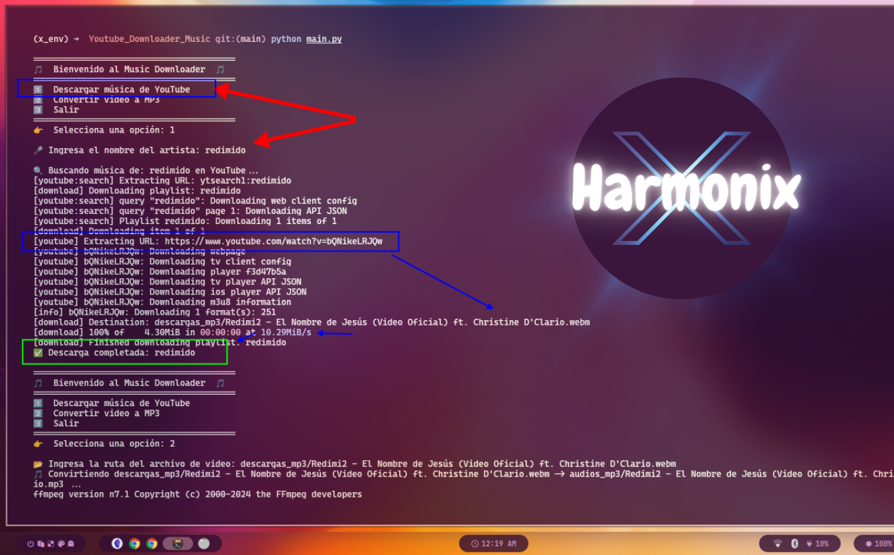

# 🎵 HarmoniX - Descarga y Convierte Música Fácilmente 🎧  


HarmoniX es una herramienta poderosa y fácil de usar que te permite **descargar música de YouTube** y **convertir videos a MP3** de manera rápida y eficiente.  

---

## 🚀 Características  
✅ **Descarga música** desde YouTube en formato MP3  
✅ **Convierte videos** a MP3 con alta calidad  
✅ **Interfaz de terminal intuitiva y decorada**  
✅ **Compatible con Windows, Linux (Ubuntu, Kali, Arch) y macOS**  
✅ **Uso de entornos virtuales para mayor estabilidad**  

---

## 📌 **Requisitos Previos**  

### 🐍 **Instalar Python (si no lo tienes)**  

🔹 **Windows**  
1️⃣ Descarga e instala **Python 3.10+** desde: [python.org/downloads](https://www.python.org/downloads/)  
2️⃣ **Asegúrate de marcar la opción** `"Add Python to PATH"` durante la instalación.  
3️⃣ Verifica la instalación con:  
   ```bash
   python --version
   ```

🔹 **Linux (Ubuntu, Kali, Arch, Debian)**  
1️⃣ Verifica si tienes Python instalado:  
   ```bash
   python3 --version
   ```
2️⃣ Si no lo tienes, instálalo:  
   - **Ubuntu / Debian / Kali:**  
     ```bash
     sudo apt update && sudo apt install python3 python3-pip -y
     ```
   - **Arch Linux:**  
     ```bash
     sudo pacman -S python python-pip
     ```

🔹 **macOS**  
```bash
brew install python3
```

---

## 🛠 **Instalación de HarmoniX**  

### **1️⃣ Clonar el Proyecto**  
```bash
git clone https://github.com/santanaoliva-u/HarmoniX.git
cd HarmoniX
```

### **2️⃣ Crear un Entorno Virtual (Opcional, pero Recomendado)**  
```bash
python3 -m venv x_env    # Crea el entorno virtual
```

🔹 **Activar el entorno virtual:**  
- **Windows**:  
  ```bash
  x_env\Scripts\activate
  ```
- **Linux/macOS**:  
  ```bash
  source x_env/bin/activate
  ```

🔹 **Para salir del entorno virtual:**  
```bash
deactivate
```

---

### **3️⃣ Instalar Dependencias**  
```bash
pip install -r requirements.txt
```

---

### **4️⃣ Instalar ffmpeg (Necesario para la conversión de audio)**  

🔹 **Windows:**  
1️⃣ Descarga **ffmpeg** de [ffmpeg.org/download.html](https://ffmpeg.org/download.html)  
2️⃣ Extrae y agrega la carpeta `bin` de ffmpeg al `PATH`.  
3️⃣ Verifica con:  
   ```bash
   ffmpeg -version
   ```

🔹 **Linux (Ubuntu/Kali/Debian):**  
```bash
sudo apt install ffmpeg -y
```

🔹 **Arch Linux:**  
```bash
sudo pacman -S ffmpeg
```

🔹 **macOS:**  
```bash
brew install ffmpeg
```

---

### **5️⃣ Ejecutar la Aplicación**  
```bash
python main.py
```

🔹 **Opciones Disponibles:**  
- **1️⃣ Descargar Música**: Ingresa el nombre del artista  
- **2️⃣ Convertir Video a MP3**: Especifica la ruta del archivo  
- **3️⃣ Salir**  

---

## 📦 **Generar Automáticamente el `requirements.txt`**  

Si has instalado dependencias adicionales o necesitas regenerar `requirements.txt`, puedes hacerlo de dos maneras:  

### 🔹 **Opción 1: Usando `pipreqs` (Recomendado)**  
Este método escanea solo los archivos `.py` del proyecto y detecta los paquetes necesarios.  

1️⃣ Instala `pipreqs`:  
   ```bash
   pip install pipreqs
   ```  
2️⃣ Genera el `requirements.txt`:  
   ```bash
   pipreqs /ruta/del/proyecto --force
   ```  
🔹 **Ejemplo**: Si tu código está en `~/HarmoniX`, ejecuta:  
   ```bash
   pipreqs ~/HarmoniX --force
   ```

---

### 🔹 **Opción 2: Usando `pip freeze` (Incluye TODAS las dependencias del entorno virtual)**  
Este método guarda todos los paquetes instalados en el entorno virtual, incluso los que no son necesarios para el proyecto.  

```bash
pip freeze > requirements.txt
```

📌 **Recomendación**: Usa `pipreqs` para obtener solo las dependencias del proyecto y no todo el entorno.  

---


## 💡 **Contribuir al Proyecto**  
Si quieres mejorar HarmoniX, sigue estos pasos:  

1️⃣ **Haz un Fork** en [GitHub](https://github.com/santanaoliva-u/HarmoniX)  
2️⃣ Clona tu fork:  
   ```bash
   git clone https://github.com/TU-USUARIO/HarmoniX.git
   cd HarmoniX
   ```  
3️⃣ Crea una nueva rama:  
   ```bash
   git checkout -b mi-nueva-funcion
   ```  
4️⃣ Realiza tus cambios y súbelos:  
   ```bash
   git add .
   git commit -m "Añadida nueva función"
   git push origin mi-nueva-funcion
   ```  
5️⃣ **Crea un Pull Request** en GitHub  

---

## 📝 **Licencia**  
HarmoniX es un proyecto de código abierto bajo la licencia **MIT**. ¡Úsalo y mejoralo libremente!  

---

🎶 **Disfruta tu música con HarmoniX** 🚀  
🔗 GitHub: [santanaoliva-u/HarmoniX](https://github.com/santanaoliva-u/HarmoniX)  
```

---

## `requirements.txt` (Archivo de Dependencias)**  
bash```
yt-dlp
ffmpeg-python
colorama
```

---

